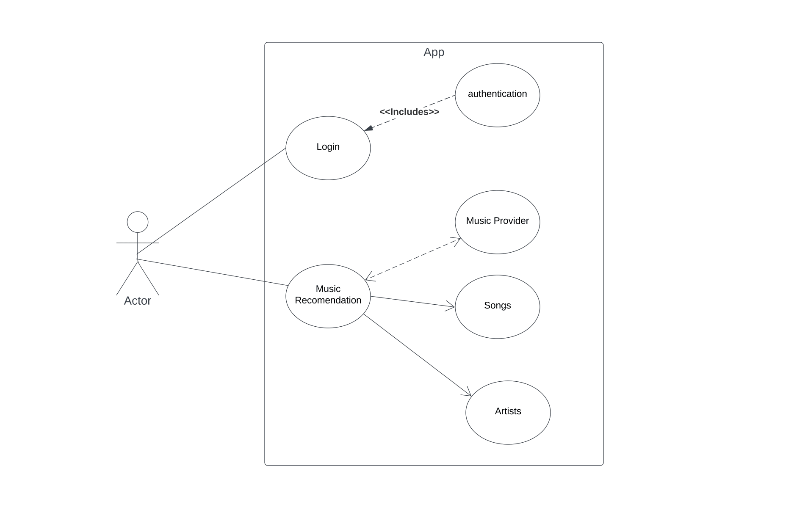
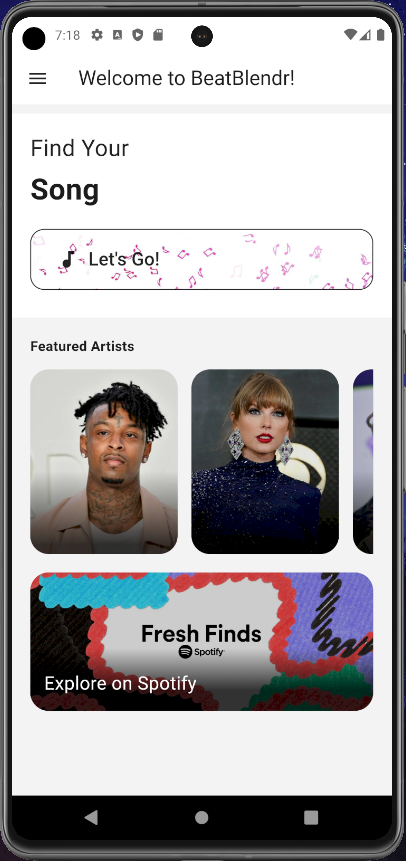
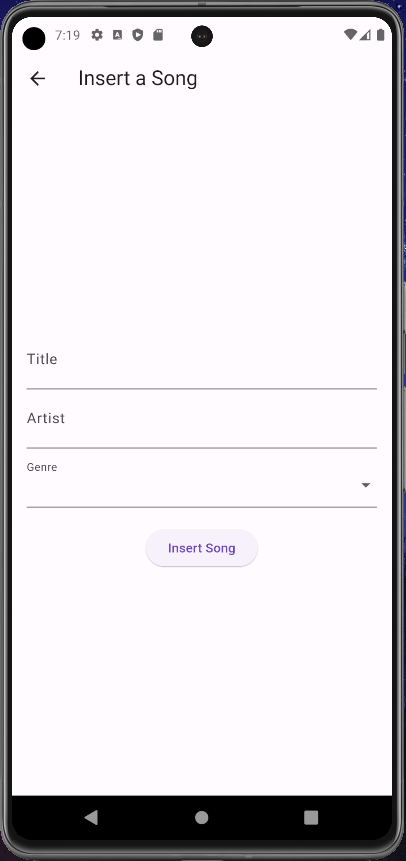
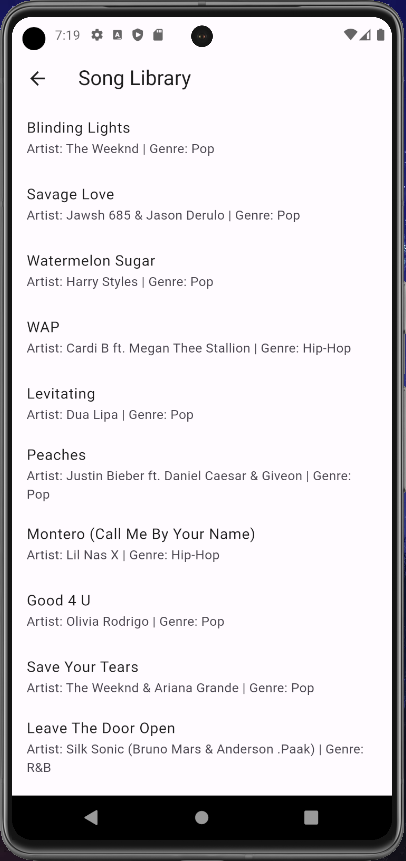
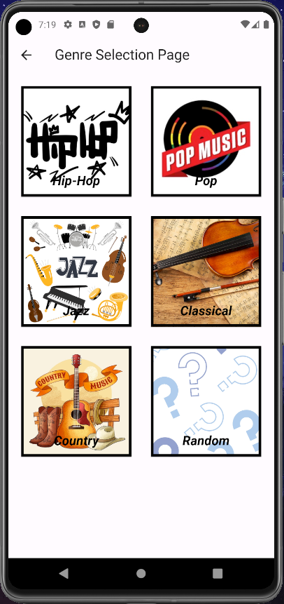

# BeatBlendr
An app to give users personalized music recommendations.

### Made by: 
---
#### Brendan Lewis - CIS 350 03
#### Andrew Showers - CIS 350 03
---
## 1 Abstract
BeatBlendr is a mobile application that provides personalized music recommendations to the client. At its core, BeatBlendr offers a unique approach to music exploration, allowing the user to find their new favorite song with the click of a button. The app utalizes Dart for the backend and Flutter for the front end. BeatBlendr allows for a new type of genre-based recommendations, where the user may select their preferred genre, and BeatBlendr responds with a random track from its large song library. 
The applications song library is dynamic and allows for users to input a song of their choice. This created a diverse collection of music tailored to the communities interests. 
Key features of BeatBlendr include its user-friendly interface, ensuring easy navigation between pages and an enjoyable user experience. The apps personalized recommendation system is designed to give the client a randomized song based on their genre selection. 
BeatBlendr is targeted towards a broad audience, becoming the perfect companion for someone looking to expand their musical horizons. Whether you are an avid music enthusiast, or simply looking for a song to fit your mood, BeatBlendr offers a new exciting way to discover music personalized to you.

## 2 Introduction
The goal of this app is to help users discover music that they enjoy in a fast, easy to use form. Users will select their favorite genre, and recieve a personalized feed of music that they might enjoy. The user may also add to the extensive song library and view all of its contents if they wish.

## 3 Architectural Design
The app will be a Client-Server Application where the app will send a request with their genre of choice to the server and recieve the song recomendations back. The server will uses the database to search for known songs.

 ### 3.1 Use Case Diagram

  
   
   
 Figure 1: Use Case Diagram for BeatBlendr

 ### 3.2 Sequence Diagram
 

  
   
   
  Figure 2: Sequence Diagram for BeatBlendr

 ### 3.3 Class Diagram
 

  
   
   
  Figure 3: Class Diagram for BeatBlendr

## 4 User Guide/Implementation

### 4.1 Home Page

  

Click on the 'Let's Go' button to move to the genre selection page.

### 4.2 Insert Data Page

  

Insert a song by typing the Title and Artist, then select the drop down window to choose the Genre of song. Once filled out, select the 'Insert song' button to add your song to the library.

### 4.3 Display Data Page

  

This page displays the hardcoded list of songs and songs that the user has added manualy.

### 4.4 Genre Selection Page

  

This page has a variety of genre buttons, when clicked the app will pop up with a personalized song recomendation based on your selection.

## 5 Risk Analysis and Retrospective
As this app was in development, we wanted to create a login so that the user might be able to store their information. This created the risk of losing personal information such as emails, usernames, or passwords. We decided that since the app did not need to keep a record of the users songs, there was no need for authentication. Therefore, negating this risk. 
In order to tailor the app to the needs of the client, we changed the songs recommendations to a hard-coded database, instead of using a server. This allows for the user to get a response with almost no delay, and makes it much easier for the client to upload their own song to the library.
We also encountered an issue with the 'Insert a song' page. Since the software was looking for a key specific genre, if a user input 'pop' instead of the capitalized 'Pop', the song would be lost in the library. So, in order to combat this issue there is now a drop down menu so that the input will always be consistent with spelling and only allow for proper genre inputs.
At first, the song insertion page did not refresh or allow for the user to confirm that their song was added to the database. In solving this problem, after hitting 'submit' the text boxes would be cleared, and there is not a pop up that verifies the song being inserted and relays this information back to the user. 

## 6 Video

### 6.1 New Video
[https://youtu.be/RQkuuv4jIJQ](https://youtu.be/kxUia57iW4E)https://youtu.be/kxUia57iW4E

### 6.2 App Functionality 
[https://youtu.be/_NNy3aKnEnc](https://youtu.be/_NNy3aKnEnc)https://youtu.be/_NNy3aKnEnc

### 6.3 Old Video for reference
[https://youtu.be/-Fo75aVzfNM](https://youtu.be/-Fo75aVzfNM)https://youtu.be/-Fo75aVzfNM

 
