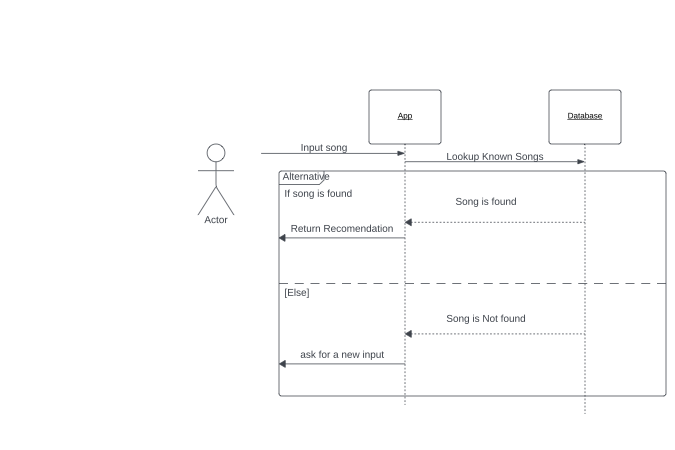

# MusicApp
An app to give users personalized music recommendations

### Made by: 
---
#### Brendan Lewis
#### Andrew Showers
---
## 1 Abstract
Welcome to the Music Recommendation App, a mobile client-server application designed to provide users with personalized song recommendations based on their input. This project utilizes the MERN stack for the backend and Flutter for the user interface. Many people are stuck listening to the same music for months to years at a time wishing that they could find something new that fits their style. This application aims to address this issue by providing simple recomendations to the user.

## 2 Introduction
The goal of this app is to help users discover music that they enjoy in a fast, easy to use form. Users will quickly input information such as: music platforms used, favorite genres, and favorite artists before getting a personalized feed of music that they might enjoy. 

## 3 Architectural Design
The app will be a Client-Server Application where the app will send a request with their song/artist of choice to the server and recieve the song recomendations back. The server will uses the database to search for known songs.

 ### 3.1 Use Case Diagram

  
   
   
 Figure 1: Use Case Diagram for Music App

 ### 3.2 Sequence Diagram
 

  
   
   
  Figure 2: Sequence Diagram for Music App

 ### 3.3 Class Diagram
 

  
   
   
  Figure 3: Class Diagram for Music App

## 4 Video
[https://youtu.be/-Fo75aVzfNM](https://youtu.be/-Fo75aVzfNM)https://youtu.be/-Fo75aVzfNM
 
